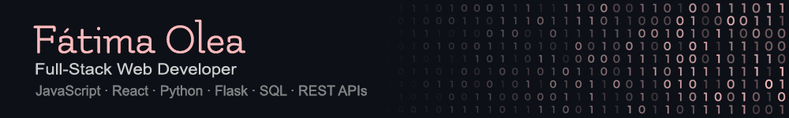
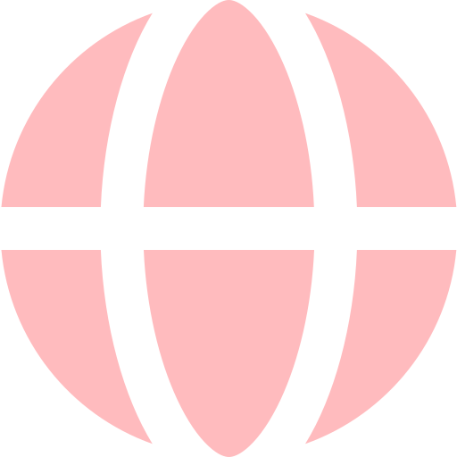

  

 Full-Stack web developer experienced in modern web technologies. With a multidisciplinary background in engineering, design, and international environments. Bringing a creative and problem-solving approach to scalable web applications and clean code practices. 

  
  
  
  
  
  
  
  
  
  
  

 

 &nbsp;&nbsp;&nbsp; 

## 🚀 About Me

- 🎓 Background in Industrial Design & Product Development Engineering
- 💻 Transitioning into full-stack software development
- 🌍 Experience working in international and multidisciplinary environments
- 🎨 Previously worked in branding, multimedia, technical coordination, and digital design
- 🧠 Interested in UX/UI, product thinking, scalable architecture, and creative development workflows

## 🎓 Education

| Degree / Program | Institution | Focus |
|---|---|---|
| Industrial Design & Product Development Engineering | Universidad Politécnica de Madrid (UPM) | Engineering, product development, design, problem-solving |
| Digital Marketing, Advertising & Multimedia Design | NETT Digital School | Digital marketing, branding, multimedia, web & visual design |
| Full-Stack Development with AI | 4Geeks Academy | React, Flask, APIs, PostgreSQL, full-stack applications |

## 📍 Availability

- Open to remote opportunities
- Open to hybrid or on-site roles in Madrid
- Open to relocation opportunities
- Interested in international and multidisciplinary environments

## ⭐ Currently

- Working on **BowlMix App**, a full-stack application focused on modular ingredient systems, smart bowl generation flows, and scalable UX architecture

- Collaborating on **Quiz App**, an international collaborative project focused on full-stack development, structured app flows, feature planning, and team-based development workflows

- Refactoring and improving **PetSpot**, enhancing architecture, user flows, scalability, and overall code quality

- Continuing to strengthen my skills in React, Flask, REST APIs, PostgreSQL, and software architecture

- Open to job opportunities and collaborative projects
